# Projects

### Machine Learning and Pattern Recognition

**2016, Shape Reconigition** C# / DirectDraw
* Based on shape context (referenced to related paper)
* Actually I want make a game, where player could draw their desired weapons.

**2017.4, Sketch rating system using DCNN** C++ / Caffe
* Give you a score about how well you sketched.
* Network based on AlexNet structure with fine-tuning

**2018, Pokemon Showdown Battle Prediction** Python / tensorflow
* Predicts Pokemon battle results based on pokemons of 2 players in this battle.
* https://github.com/linkzeldagg/Pokemon-Showdown-Win-Rate-Prediction

**2018, Machine Learning (Miscellaneous)** Python / tensorflow
* Works done in Konagaya Lab (my academic supervisor, master degree) at TokyoTech.
* Mainly focusing on generative neural networks (GANs, VAEs, etc.)
* Learning common technique & tricks used in neural networks.
* My research (currently in mid-stage): 
  * Find well-behaved, linear representations of motion dynamics (particle simulation data). 
  * Simulate (also predict) the process by some linear (affine) transformation in the latent space
  * Able to encode raw particle data (some matrix with arbitrary rows) to latent representations, as well as reconstruct them back to raw data. 
  * Using the duality of simulation process (forward & backward in time <-> linear transformation & the inverse) to improve model stability.

### Graphics and Games

**2015.11, Dynamic detail population for massive scene rendering.** Ogre / C++
* Done in a hackathon (within 48 hours)  
* It's a massive LOD system, populates millions of procedural details based on current view. Can be easily modified by artists.  
* In the demo, a grassland was shown, free from bird-view to a close view that shows "cell"s on a single grass-blade.
* minFPS = 15 @ i7-4700MQ / GTX 780M (only in specific area (a small range at middle), in other range FPS = 60 (VSync))
* I entered MSRA by this.

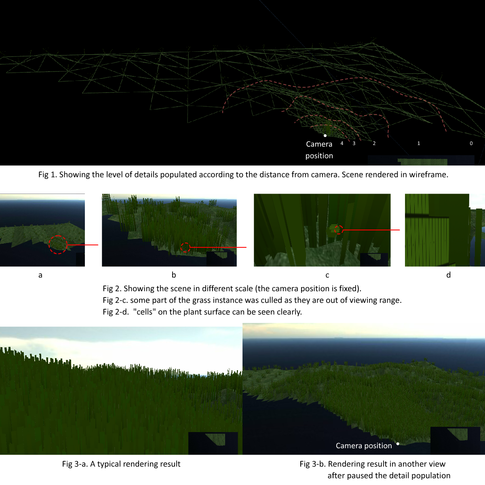

**2016.4, Realistic Procedural Generation & Rendering for Trees.** Unity
* Fractal based, totally random procedural, realistic tree & growth animation  
* Day-night cycle based on atmosphere scattering (referenced to related paper)  
* Several tricks to make the graphics better  

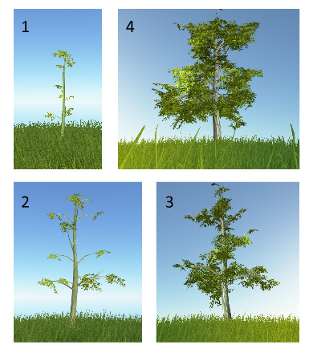  
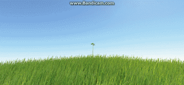  
[Poster](Images/poster.pdf)

**2017 ~ 2018, SlimeKingdom.** Unity (in progress)
* An indie fantastic 3D RPG game
* Terrain and graphics
* Contributed with friends (Mainly by myself)
* *Disclaimer: Assets bought from asset store*
    * Houses and assets in the village
    * Texture for grass and flower
    * Giant glowing plants and mushrooms
    * Aura, an open-source plugin for rendering volume scattering fx [Link](https://assetstore.unity.com/packages/vfx/shaders/aura-volumetric-lighting-111664)

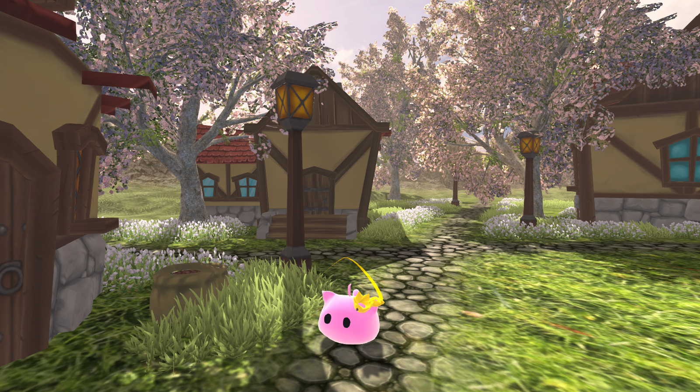
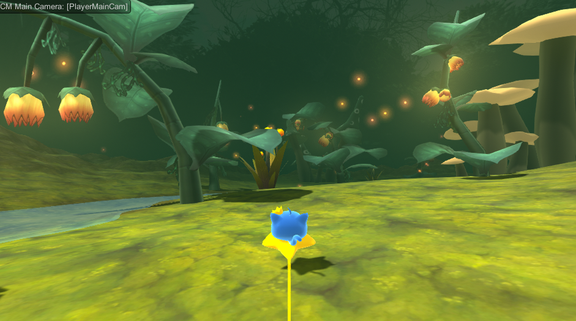
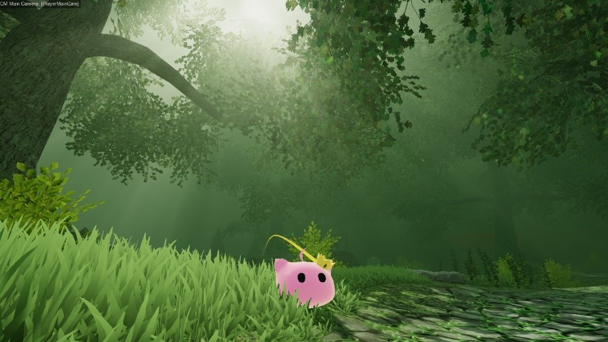

**2017.11, Voxel engine for massive scene with LOD.** OpenGL

* Dynamically generated meshes computed by GPU
* LOD makes rendering distance further (around 5km^2, 1m = 1voxel, without noticeable lagging, chunk data changes every frame)  
* High performance (w/ camera movement FPS > VSync @ GTX 1060), if ignore hard-disk I/O (when reading a pre-defined map file)
* https://github.com/linkzeldagg/GLPlayground/tree/master/CS_VoxelDrawer

Dynamic chunks and LOD:  
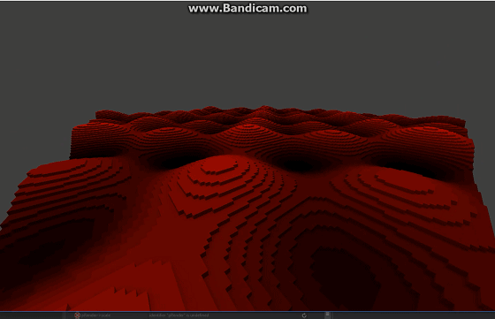
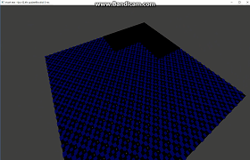

Rendering some scene:  
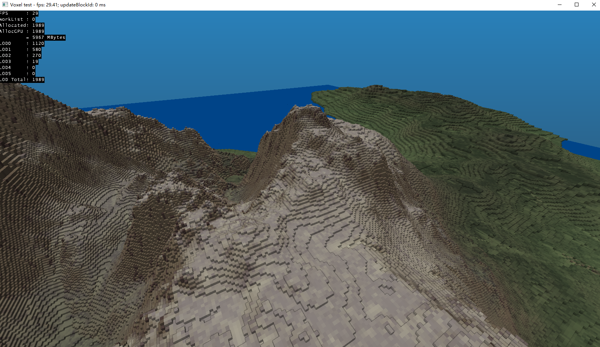
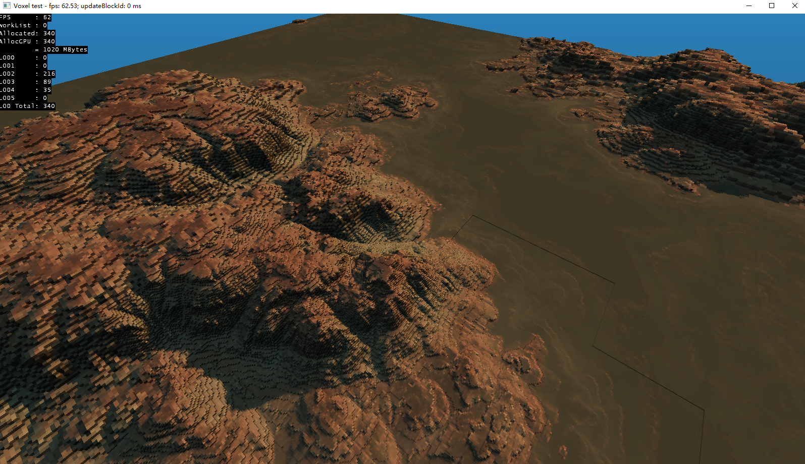

With LOD levels:  
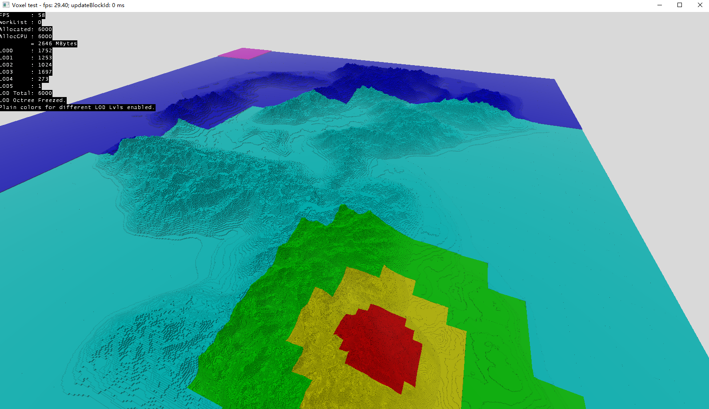
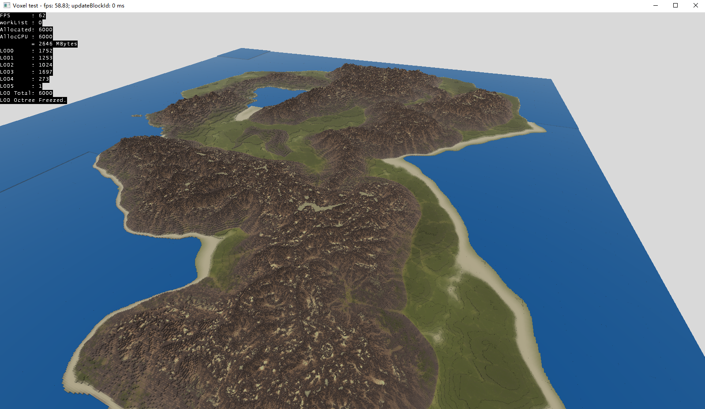

**2011, 2013 ~ 2014, 2014 ~ 2016 Minecraft-liked Game.** Ogre / C++
* A voxel-based game (like minecraft)
* Use Octrees to optimize the scene
* It was mainly done in my highschool so it is not good though

**2015, Touchann Project.** C++
* A 2D Shooting Game similar to touhou project and arcade shooting games.
* Touchann is one of my friends (

**2016, Ball-Bouncing Game.** Unity (Mobile)
* My first attempt to Unity
* A Mobile game, a ball will bounce when hitting user drawn lines.
* Control the ball hit bouns items, or it will die after several bounces.
* Special item splits a ball into two balls.

**2016.7, Vulkan rendering framework.** Vulkan / C++
* I made this for learning Vulkan (a new Graphics API).
* It is very simple.
* https://github.com/linkzeldagg/vulkanVoxelTest

**2017, "User define" magical spell generator.** Unity
* User can enter a custom string (sort of program) to create custom spells

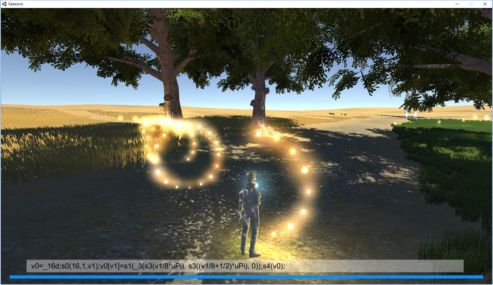

**2018, miniRAID.** WebGL (melon.js)
* a MMORPG liked single player web 2D RPG game, in progress. 
* modified low-level rendering logic of melon.js.
* Collaborated with my friends
* https://fairy-neko.github.io/miniRAID/ [Repo](https://github.com/Fairy-Neko/miniRAID)

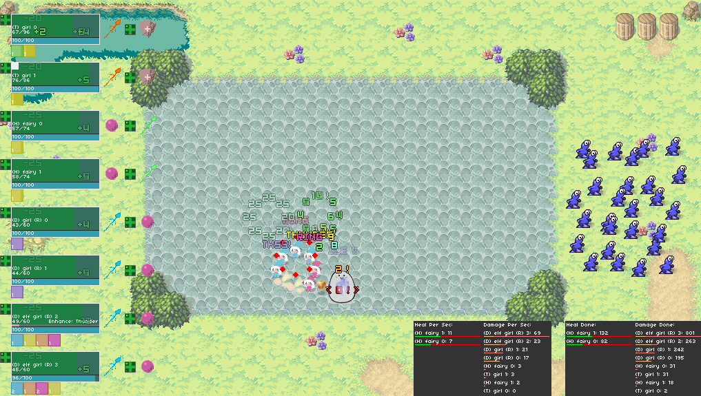

**2015 ~ 2018, Gatcha simulators** Adobe Flash / Unity
* Simulates the visual effect of Gatcha in popular mobile games
* Flash: スクフェス、艦これ（建造）、あんスタ
* Unity: 恋プロ、FGO
* Used for prize winning (lottery) program in anime & comic club annual ceremony show
* (relatively) High quality
* There are playable demos but it might not be legal to show it...

Reconstructed scene:
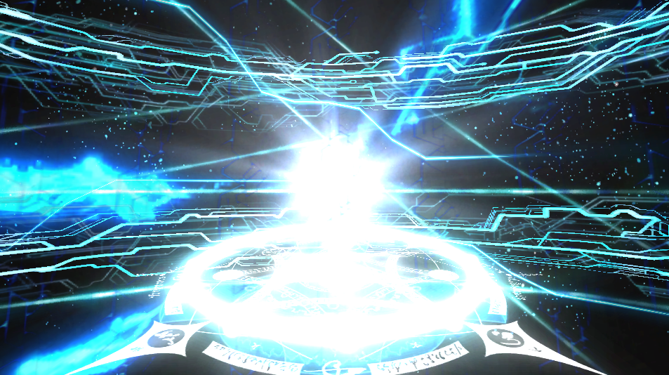
